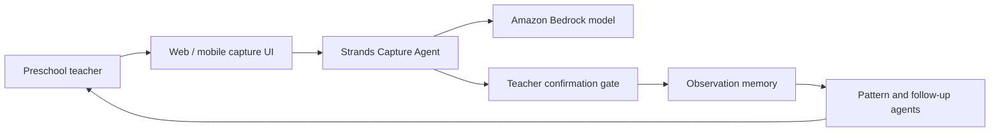

# ChildSignal MVP Architecture

当前最小切片只实现 `Teacher narrative → Capture Agent → Structured observation → Teacher confirmation required`。

本地演示使用确定性的 Strands custom model provider，因此不需要 AWS 凭证且结果可重复。设置 `CHILDSIGNAL_MODEL=bedrock` 后，同一个 Agent 会切换到 Strands `BedrockModel`。AgentCore Runtime 在云端部署阶段加入。

